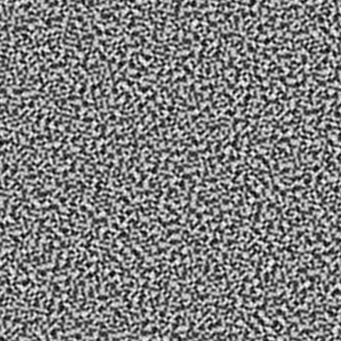

# Noisy

`nimble install noisy`

Noisy is a SIMD-accelerated Nim implementation of Simplex (Perlin) noise. The goal of this library is to be easy to use, performant and dependency-free.

Noisy works well using Nim's relatively new `--gc:arc` and `--gc:orc` as well as the default garbage collector. This library also works using both `nim c` and `nim cpp`, in addition to `--cc:vcc` on Windows.

I have also verified that Noisy builds with `--experimental:strictFuncs` on Nim 1.4.0.



## Example

```nim
import noisy, strformat

var simplex = initSimplex(1988)
simplex.frequency = 0.1

# Starting at (0, 0) generate a 16x16 grid of 2D noise values.
let values = simplex.grid((0, 0), (16, 16))
for x in 0 ..< 16:
  for y in 0 ..< 16:
    let value = values[x, y]
    echo &"({x},{y}): {value}"
```

## Performance

Benchmarks can be run comparing methods for generating noise values. Check the performance yourself by running [tests/benchmark.nim](https://github.com/guzba/noisy/blob/master/tests/benchmark.nim).

`nim c -d:release -r .\tests\benchmark.nim` (256 x 256 x 256 cube of 3D simplex noise with 3 octaves, lower time is better)

Method | Time
--- | ---:
Point by point using `value(x, y, z)` | 1.6066s
Using `grid()` (SIMD accelerated, GCC default) | 1.1329s
Using `grid()` (SIMD accelerated, `--passC:"-mavx"`) | 0.8382s

# API: noisy

```nim
import noisy
```

## **type** Simplex


```nim
Simplex = object
 octaves*: int
 amplitude*, frequency*, lacunarity*, gain*: float32
```

## **type** Grid


```nim
Grid = ref object
 width*, height*, depth*: int
 values*: seq[float32]
```

## **type** NoisyError


```nim
NoisyError = object of ValueError
```

## **func** initSimplex


```nim
func initSimplex(seed: int): Simplex
```

## **func** `[]`

Returns the noise value at (x, y) or (x, y, z).

```nim
func `[]`(g: Grid; x, y: int; z = 0): float32
```

## **func** value

Generates the 2D noise value at (x, y) based on the Simplex parameters.

```nim
func value(simplex: Simplex; x, y: float32): float32 {.raises: [NoisyError], tags: [].}
```

## **func** value

Generates the 3D noise value at (x, y, z) based on the Simplex parameters.

```nim
func value(simplex: Simplex; x, y, z: float32): float32 {.raises: [NoisyError], tags: [].}
```

## **template** value

Helper for working with ints.

```nim
template value(simplex: Simplex; x, y: int): float32
```

## **template** value

Helper for working with ints

```nim
template value(simplex: Simplex; x, y, z: int): float32
```

## **func** grid

Beginning at position start, generate a grid of 2D noise based on the Simplex parameters. The width and height of the grid is set by the dimens paramter. The start position is the bottom left of the grid at [0, 0].

```nim
func grid(simplex: Simplex; start: (float32, float32); dimens: (int, int)): Grid {.raises: [NoisyError].}
```

## **template** grid

Helper for working with ints.

```nim
template grid(simplex: Simplex; start: (int, int); dimens: (int, int)): Grid
```

## **func** grid

Beginning at position start, generate a grid of 3D noise based on the Simplex parameters. The width, depth, and height of the grid is set by the dimens paramter. The start position is the near bottom left of the grid at [0, 0, 0].

```nim
func grid(simplex: Simplex; start: (float32, float32, float32);
 dimens: (int, int, int)): Grid {.raises: [NoisyError].}
```

## **template** grid

Helper for working with ints.

```nim
template grid(simplex: Simplex; start: (int, int, int); dimens: (int, int, int)): Grid
```
